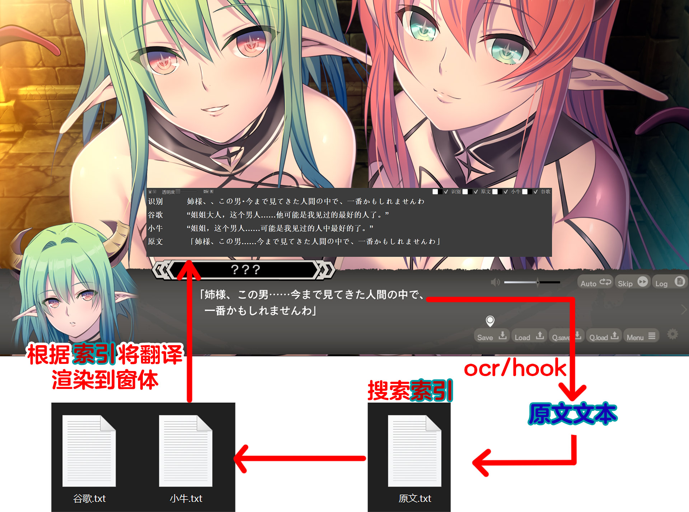

# 概述

将本地txt文件里的译文加载到置顶窗口，实现Galgame的外挂字幕。` `
（本人菜鸟，写的代码很垃圾，此项的目的更多是抛砖引玉...）

# 项目背景&意义

* 迫切想玩某Galgame但无汉化，且由于各种原因无法从在线翻译API获得良好的游戏体验；
* Galgame解包容易封包难（大佬除外）；
* 机器翻译越来越精准，特别是ChatGPT的出现，让机翻效果得到巨大提升；
* 一个较好的机翻文本可由多人共用而不需封包游戏文件。

# 效果演示

演示视频：[演示视频](./dev-tool/演示视频.mp4) 或 [视频床](https://files.catbox.moe/wipn2u.mp4)

图片预览：无

置顶的文本窗口可盖住原文（因为是对游戏窗口截图）

# 测试环境&使用说明

## **测试环境**

**开发环境 Python3.7**

| 库            | 版本     |
| ------------- | -------- |
| requests      | 2.28.2   |
| pywin32       | 306      |
| Pillow        | 9.4.0    |
| pynput        | 1.7.6    |
| PyQt5         | 5.15.9   |
| opencv-python | 4.7.0.72 |

## 使用说明

1. 首先应确定环境配置好，然后txt目录中包含txt文件。
   至少包含“原文.txt”。仓库中的文本来源于《深淵のラビリントス》。
2. 编辑main.py文件。
   window_name = ['深淵のラビリントス', '1.00']  # 用于搜索游戏窗口的关键词
   比如这里的游戏窗口名为“深淵のラビリントス  1.00”，设置上面的关键词即可准确定位游戏窗口，当然也可以少些点关键词，检索到多个匹配窗口的话，会让选择的。
3. 确保有OCR服务地址，这里直接用的是[团子翻译器](https://translator.dango.cloud/)打包的OCR。
   团子翻译器新版不再发布github Releases，所以我测试时是先安装好团子翻译器，然后单独运行了**\DangoTranslator\app\ocr\startOCR.cmd**
4. 执行**python.exe main.py**，或运行**#start_window.bat（需配置或修改）**
5. 我应该不会进行打包，毕竟写得烂（~~我很懒~~）
6. 点击“Dir”按钮选择txt文件目录
7. 点击“R”按钮刷新txt文件目录
8. 直接关闭命令提示符窗口来退出程序，点击窗口的关闭按钮多半会程序无响应~~这是BUG~~

# 思路说明

* 见图片：[思路说明](./dev-tool/思路说明.jpg)
  
* 大致就如上图所示了，思路不难所以懒得解释了。
* 将txt文本读取到内存，按行分割为列表，然后通过Python自带的difflib.SequenceMatcher()搜索“原文.txt”。
* 通过记录上一次匹配到的索引来减少搜索时间。

# 未完成功能

* 窗口透明度可调节
* 游戏中可调整OCR区域
* 配置本地存储（先完成上条）
  
  * 包括：OCR截图位置，窗口大小，透明度，txt文件夹，
* ……
